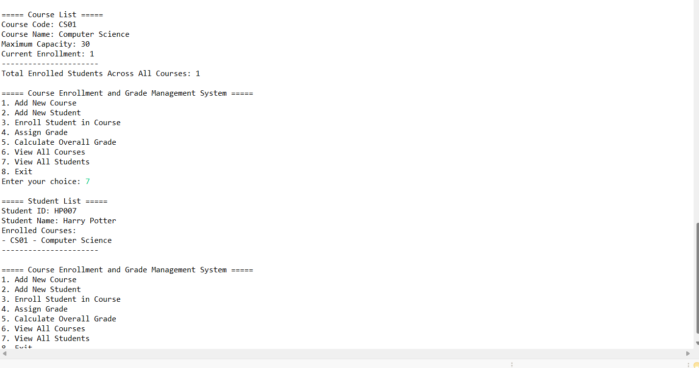

# Course Enrollment System

A console based Java application for managing students, courses, enrollment, course capacity, and grades.

## Application Preview



## Features

* Add courses using a course code, name, and maximum capacity
* Prevent duplicate course codes
* Add students using a name and unique student ID
* Prevent duplicate student IDs
* Enroll students in available courses
* Prevent duplicate enrollment
* Enforce course capacity limits
* Assign grades from 0 to 100
* Calculate a student’s overall average grade
* Display all students and courses
* Track enrollment totals across courses
* Validate numeric entries and menu selections

## Java Concepts Demonstrated

* Object oriented programming with `Student`, `Course`, and `CourseManagement` classes
* Encapsulation, constructors, and methods
* Relationships between objects
* `ArrayList` and `HashMap` collections
* Static fields and methods
* Loops, conditional statements, and switch cases
* User input with `Scanner`
* Input validation and error handling

## Running the Program

```bash
javac CourseEnrollmentSystem.java
java CourseEnrollmentSystem
```

The application stores information in memory, so the records reset when the program closes.
