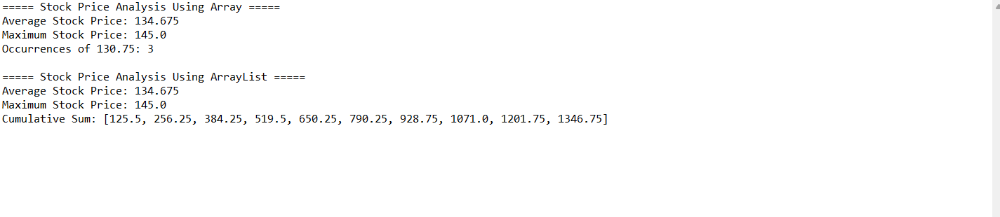

# Stock Price Analysis

A Java application that analyzes a collection of opening stock prices using both an array and an `ArrayList`.

## Analysis Preview



## Features

* Store ten days of opening stock prices
* Calculate the average stock price
* Identify the maximum stock price
* Count how many times a target price appears
* Calculate a running cumulative sum
* Compare operations using arrays and `ArrayList`
* Display the analysis results in the console

## Java Concepts Demonstrated

* Arrays and `ArrayList` collections
* Method overloading
* Loops and numeric calculations
* Floating point values
* Searching and counting values
* Cumulative data processing
* Reusable methods and modular program structure

## Running the Program

```bash
javac StockPriceAnalysis.java
java StockPriceAnalysis
```
