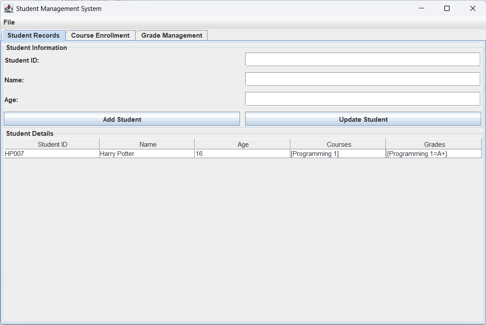

# Student Management GUI

A Java Swing desktop application for managing student records, course enrollment, and grades through a graphical user interface.

## Application Preview



## Features

* Add students using an ID, name, and age
* Update existing student information
* Display student records in a table
* Enroll students in available courses
* Prevent duplicate student IDs and course enrollment
* Assign grades to enrolled courses
* Display each student’s courses and grades
* Validate user input and display helpful dialog messages
* Navigate between student records, enrollment, and grade management using tabs

## Java Concepts Demonstrated

* Object oriented programming and encapsulation
* Java Swing graphical user interfaces
* Event driven programming
* `JFrame`, `JTabbedPane`, `JTable`, and dialog components
* `ArrayList` and `HashMap` collections
* Input validation and exception handling
* Lambda expressions and action listeners

## Running the Program

```bash
javac StudentManagementGUI.java
java StudentManagementGUI
```

The application stores information in memory, so the records reset when the program closes.
